# SnackBase Architecture

```mermaid
graph TB
    subgraph "FRONTEND - React + TypeScript"
        subgraph "UI Layer"
            LP[LoginPage]
            DP[DashboardPage]
            AP[AccountsPage]
            UP[UsersPage]
            GP[GroupsPage]
            CP[CollectionsPage]
            RP[RecordsPage]
            ROP[RolesPage]
            ALP[AuditLogsPage]
            AL[AdminLayout]
            PR[ProtectedRoute]
        end

        subgraph "Components"
            ACC_COMP[Accounts Components]
            USER_COMP[Users Components]
            GROUP_COMP[Groups Components]
            COLL_COMP[Collections Components]
            REC_COMP[Records Components]
            ROLE_COMP[Roles Components]
            SHADCN[ShadCN UI Components]
        end

        subgraph "State & Services"
            ZS[Zustand Auth Store]
            AS[auth.service]
            ACS[accounts.service]
            US[users.service]
            GS[groups.service]
            CS[collections.service]
            RS[records.service]
            ROS[roles.service]
            DS[dashboard.service]
        end

        LP --> AS
        DP --> DS
        AP --> ACS
        UP --> US
        GP --> GS
        CP --> CS
        RP --> RS
        ROP --> ROS
    end

    subgraph "API LAYER - FastAPI"
        subgraph "App Factory"
            APP[app.py]
            LIFESPAN[Lifespan Manager]
            MW[Middleware Stack]
        end

        subgraph "Dependencies"
            GET_USER[get_current_user]
            REQ_SA[require_superadmin]
            GET_ROLE[get_user_role_id]
            AUTH_CTX[get_authorization_context]
        end

        subgraph "Middleware"
            AUTH_MW[Authorization Middleware]
            LOG_MW[Logging Middleware]
            CORS_MW[CORS Middleware]
        end

        subgraph "Routers (11)"
            AUTH_R[/auth/]
            ACC_R[/accounts/]
            COLL_R[/collections/]
            ROLE_R[/roles/]
            PERM_R[/permissions/]
            USER_R[/users/]
            GROUP_R[/groups/]
            INV_R[/invitations/]
            MACRO_R[/macros/]
            DASH_R[/dashboard/]
            REC_R[/records/]
        end

        subgraph "Schemas"
            AUTH_S[auth_schemas]
            ACC_S[account_schemas]
            COLL_S[collection_schemas]
            ROLE_S[role_schemas]
            PERM_S[permission_schemas]
            USER_S[users_schemas]
            GROUP_S[group_schemas]
            INV_S[invitation_schemas]
            MACRO_S[macro_schemas]
            DASH_S[dashboard_schemas]
            REC_S[record_schemas]
        end

        AS --> AUTH_R
        ACS --> ACC_R
        US --> USER_R
        GS --> GROUP_R
        CS --> COLL_R
        RS --> REC_R
        ROS --> ROLE_R
        DS --> DASH_R
    end

    subgraph "CORE LAYER - Zero Framework Dependencies"
        CFG[config.py<br/>Settings]
        LOG[logging.py<br/>structlog]

        subgraph "Hook System"
            HE[Hook Events]
            HR[Hook Registry]
            HD[Hook Decorator]
        end

        subgraph "Rule Engine"
            LEX[Lexer]
            PAR[Parser]
            AST[AST Nodes]
            EVAL[Evaluator]
        end

        subgraph "Macro Engine"
            ME[Macro Execution Engine]
        end
    end

    subgraph "DOMAIN LAYER - Business Logic"
        subgraph "Entities (12)"
            ACCT[Account]
            USRE[User]
            RLE[Role]
            PERM[Permission]
            COLL[Collection]
            GRP[Group]
            INV[Invitation]
            HC[HookContext]
        end

        subgraph "Domain Services (12)"
            AIG[AccountIdGenerator]
            SG[SlugGenerator]
            PV[PasswordValidator]
            RV[RecordValidator]
            CV[CollectionValidator]
            PR[PermissionResolver]
            PC[PermissionCache]
            PII[PIIMaskingService]
            SAS[SuperadminService]
            DAS[DashboardService]
            AcS[AccountService]
            CoS[CollectionService]
        end
    end

    subgraph "APPLICATION LAYER - Use Cases"
        CMD[Commands<br/>Empty/TODO]
        QRY[Queries<br/>Empty/TODO]
    end

    subgraph "INFRASTRUCTURE LAYER"
        subgraph "Persistence"
            DM[DatabaseManager]
            TB[TableBuilder]

            subgraph "ORM Models (10)"
                AM[AccountModel]
                UM[UserModel]
                RM[RoleModel]
                PM[PermissionModel]
                CM[CollectionModel]
                MM[MacroModel]
                GM[GroupModel]
                IM[InvitationModel]
                RTM[RefreshTokenModel]
            end

            subgraph "Repositories (10)"
                AR[AccountRepository]
                UR[UserRepository]
                RR[RoleRepository]
                PR[PermissionRepository]
                CR[CollectionRepository]
                RCR[RecordRepository]
                MR[MacroRepository]
                GR[GroupRepository]
                IR[InvitationRepository]
                RTR[RefreshTokenRepository]
            end
        end

        subgraph "Auth"
            JWT[JWT Service]
            PH[Password Hasher<br/>Argon2id]
        end

        subgraph "Services"
            TS[Token Service]
            ES[Email Service]
        end

        subgraph "Built-in Hooks"
            BHS[Built-in Hooks]
            TS_H[timestamp_hook]
            AI_H[account_isolation_hook]
            CB_H[created_by_hook]
        end

        subgraph "Empty/TODO"
            RT[Realtime<br/>WebSocket/SSE]
            ST[Storage<br/>File Storage]
        end
    end

    subgraph "DATABASE"
        DB[(SQLite/PostgreSQL)]
    end

    %% Frontend to API
    AS -.HTTP.-> AUTH_R
    ACS -.HTTP.-> ACC_R
    US -.HTTP.-> USER_R
    GS -.HTTP.-> GROUP_R
    CS -.HTTP.-> COLL_R
    RS -.HTTP.-> REC_R
    ROS -.HTTP.-> ROLE_R
    DS -.HTTP.-> DASH_R

    %% API to Domain
    AUTH_R --> PR
    ACC_R --> AcS
    COLL_R --> CoS
    ROLE_R --> PR
    USER_R --> AIG
    GROUP_R --> AcS
    REC_R --> RV
    REC_R --> PII

    %% Domain to Infrastructure
    AcS --> AR
    CoS --> CR
    PR --> PR
    DAS --> DM
    SAS --> AR

    %% Repositories to Models
    AR --> AM
    UR --> UM
    RR --> RM
    PR --> PM
    CR --> CM
    MR --> MM
    GR --> GM
    IR --> IM
    RTR --> RTM
    RCR --> TB

    %% Models to Database
    AM --> DB
    UM --> DB
    RM --> DB
    PM --> DB
    CM --> DB
    MM --> DB
    GM --> DB
    IM --> DB
    RTM --> DB

    %% Core to Domain
    HR --> HC
    ME --> PR

    %% Rule Engine Flow
    PR --> LEX
    LEX --> PAR
    PAR --> AST
    AST --> EVAL
    EVAL --> ME

    %% Hook System
    APP --> HR
    HD --> HR
    BHS --> HR

    %% Config & Logging
    APP --> CFG
    APP --> LOG
    LIFESPAN --> HR
    LIFESPAN --> DM

    %% Middleware Flow
    APP --> MW
    MW --> CORS_MW
    MW --> LOG_MW
    MW --> AUTH_MW
    AUTH_MW --> PR

    %% Auth Flow
    AUTH_R --> JWT
    AUTH_R --> PH
    USER_R --> PH

    %% Services
    INV_R --> ES
    AUTH_R --> TS

    %% Lifecycle
    APP --> LIFESPAN
    LIFESPAN --> BHS

    %% Dynamic Tables
    RCR --> TB
    TB --> DB

    classDef frontend fill:#e1f5fe,stroke:#01579b,stroke-width:2px
    classDef api fill:#fff3e0,stroke:#e65100,stroke-width:2px
    classDef core fill:#f3e5f5,stroke:#4a148c,stroke-width:2px
    classDef domain fill:#e8f5e9,stroke:#1b5e20,stroke-width:2px
    classDef app fill:#fce4ec,stroke:#880e4f,stroke-width:2px
    classDef infra fill:#fff8e1,stroke:#f57f17,stroke-width:2px
    classDef db fill:#cfd8dc,stroke:#37474f,stroke-width:2px

    class LP,DP,AP,UP,GP,CP,RP,ROP,ALP,AL,PR,ACC_COMP,USER_COMP,GROUP_COMP,COLL_COMP,REC_COMP,ROLE_COMP,SHADCN,ZS,AS,ACS,US,GS,CS,RS,ROS,DS frontend
    class APP,LIFESPAN,MW,GET_USER,REQ_SA,GET_ROLE,AUTH_CTX,AUTH_MW,LOG_MW,CORS_MW,AUTH_R,ACC_R,COLL_R,ROLE_R,PERM_R,USER_R,GROUP_R,INV_R,MACRO_R,DASH_R,REC_R,AUTH_S,ACC_S,COLL_S,ROLE_S,PERM_S,USER_S,GROUP_S,INV_S,MACRO_S,DASH_S,REC_S api
    class CFG,LOG,HE,HR,HD,LEX,PAR,AST,EVAL,ME core
    class ACCT,USRE,RLE,PERM,COLL,GRP,INV,HC,AIG,SG,PV,RV,CV,PR,PC,PII,SAS,DAS,AcS,CoS domain
    class CMD,QRY app
    class DM,TB,AM,UM,RM,PM,CM,MM,GM,IM,RTM,AR,UR,RR,PR,CR,RCR,MR,GR,IR,RTR,JWT,PH,TS,ES,BHS,TS_H,AI_H,CB_H,RT,ST infra
    class DB db
```



## Architecture Overview

SnackBase follows **Clean Architecture** principles with clear separation between business logic and infrastructure concerns.

### Layer Structure

| Layer                    | Purpose                    | Dependencies                 |
| ------------------------ | -------------------------- | ---------------------------- |
| **Frontend**             | React admin UI             | API Layer (HTTP)             |
| **API Layer**            | FastAPI routes, middleware | Domain, Core, Infrastructure |
| **Core Layer**           | Cross-cutting concerns     | Zero framework deps          |
| **Domain Layer**         | Business logic, entities   | Core only                    |
| **Application Layer**    | Use cases (placeholder)    | Domain                       |
| **Infrastructure Layer** | External concerns          | Domain, Core                 |

### Key Architectural Patterns

1. **Repository Pattern**: 10 repositories abstract data access
2. **Service Layer Pattern**: 12 domain services contain business logic
3. **Hook System**: 33+ events for extensibility (stable API v1.0)
4. **Rule Engine**: Custom DSL for permission expressions
5. **Multi-Tenancy**: Row-level isolation via `account_id`
6. **JWT Authentication**: Access token (1h) + refresh token (7d)

### Component Statistics

- **11 API Routers** (auth, accounts, collections, roles, permissions, users, groups, invitations, macros, dashboard, records)
- **10 ORM Models** (Account, User, Role, Permission, Collection, Macro, Group, Invitation, RefreshToken, UsersGroups)
- **10 Repositories** matching each model
- **12 Domain Entities** + **12 Domain Services**
- **9 React Pages** + **32+ Components**
- **14 ShadCN UI Components**

### Technology Stack

| Category   | Technology                                    |
| ---------- | --------------------------------------------- |
| Backend    | Python 3.12+, FastAPI, SQLAlchemy 2.0 (async) |
| Database   | SQLite (dev), PostgreSQL (prod)               |
| Frontend   | React 19, TypeScript, Vite 7, React Router v7 |
| UI         | TailwindCSS 4, Radix UI, ShadCN, Lucide Icons |
| State      | Zustand, TanStack Query                       |
| Auth       | JWT (HS256), Argon2id password hashing        |
| Logging    | structlog (JSON in production)                |
| Validation | Pydantic, Zod                                 |

### Data Flow Examples

**Authentication Flow:**

```
LoginPage → auth.service.login()
  → POST /api/v1/auth/login
  → JWT Service creates tokens
  → UserRepository updates last_login
  → Return AuthResponse
  → Zustand Store stores tokens
```

**Permission Check Flow:**

```
GET /api/v1/records/posts
  → Authorization Middleware
  → PermissionResolver.resolve_permission()
    → Rule Engine: parse_rule() → Lexer → Parser → AST
    → Evaluator.evaluate() with MacroExecutionEngine
    → PermissionCache (5-min TTL)
  → If allowed: RecordRepository.find_all()
  → PIIMaskingService masks sensitive fields
  → Return filtered response
```

**Record Creation Flow:**

```
POST /api/v1/records/posts
  → Validate request fields
  → Permission check
  → RecordValidator.validate_and_apply_defaults()
  → Trigger ON_RECORD_BEFORE_CREATE hooks
    → account_isolation_hook (priority: -200)
    → created_by_hook (priority: -150)
    → timestamp_hook (priority: -100)
    → User hooks (priority: ≥0)
  → RecordRepository.insert_record()
  → Trigger ON_RECORD_AFTER_CREATE hooks
  → Apply field filter + PII masking
  → Return RecordResponse
```

### Key Files

| File                                                        | Purpose                                  |
| ----------------------------------------------------------- | ---------------------------------------- |
| `src/snackbase/infrastructure/api/app.py`                   | FastAPI app factory                      |
| `src/snackbase/core/config.py`                              | Pydantic Settings                        |
| `src/snackbase/core/hooks/hook_registry.py`                 | Hook system core                         |
| `src/snackbase/core/rules/`                                 | Rule engine (lexer→parser→AST→evaluator) |
| `src/snackbase/domain/services/permission_resolver.py`      | Permission resolution                    |
| `src/snackbase/infrastructure/persistence/database.py`      | SQLAlchemy engine                        |
| `src/snackbase/infrastructure/persistence/table_builder.py` | Dynamic table creation                   |
| `ui/src/main.tsx`                                           | React app entry                          |
| `ui/src/App.tsx`                                            | Route configuration                      |
| `ui/src/lib/api.ts`                                         | Axios client with token refresh          |
