# SnackBase Architecture

```mermaid
graph TB
    subgraph "FRONTEND - React + TypeScript"
        subgraph "UI Layer"
            LP[LoginPage]
            DP[DashboardPage]
            AP[AccountsPage]
            UP[UsersPage]
            GP[GroupsPage]
            CP[CollectionsPage]
            RP[RecordsPage]
            ROP[RolesPage]
            ALP[AuditLogsPage]
            ETP[EmailTemplatesPage]
            AL[AdminLayout]
            PR[ProtectedRoute]
        end

        subgraph "Components"
            ACC_COMP[Accounts Components]
            USER_COMP[Users Components]
            GROUP_COMP[Groups Components]
            COLL_COMP[Collections Components]
            REC_COMP[Records Components]
            ROLE_COMP[Roles Components]
            EMAIL_COMP[Email Components]
            SHADCN[ShadCN UI Components]
        end

        subgraph "State & Services"
            ZS[Zustand Auth Store]
            AS[auth.service]
            ACS[accounts.service]
            US[users.service]
            GS[groups.service]
            CS[collections.service]
            RS[records.service]
            ROS[roles.service]
            DS[dashboard.service]
            ESVC[email.service]
        end

        LP --> AS
        DP --> DS
        AP --> ACS
        UP --> US
        GP --> GS
        CP --> CS
        RP --> RS
        ROP --> ROS
        ETP --> ESVC
    end

    subgraph "API LAYER - FastAPI"
        subgraph "App Factory"
            APP[app.py]
            LIFESPAN[Lifespan Manager]
            MW[Middleware Stack]
        end

        subgraph "Dependencies"
            GET_USER[get_current_user]
            REQ_SA[require_superadmin]
            GET_ROLE[get_user_role_id]
            AUTH_CTX[get_authorization_context]
        end

        subgraph "Middleware"
            AUTH_MW[Authorization Middleware]
            LOG_MW[Logging Middleware]
            CORS_MW[CORS Middleware]
        end

        subgraph "Routers (19)"
            AUTH_R[/auth/]
            OAUTH_R[/oauth/]
            SAML_R[/saml/]
            ACC_R[/accounts/]
            COLL_R[/collections/]
            ROLE_R[/roles/]
            PERM_R[/permissions/]
            USER_R[/users/]
            GROUP_R[/groups/]
            INV_R[/invitations/]
            MACRO_R[/macros/]
            DASH_R[/dashboard/]
            FILES_R[/files/]
            AUDIT_R[/audit-logs/]
            MIG_R[/migrations/]
            ADMIN_R[/admin/]
            EMAIL_T_R[/email_templates/]
            REC_R[records_router]
            HEALTH_R[/health/]
        end

        subgraph "Schemas"
            AUTH_S[auth_schemas]
            ACC_S[account_schemas]
            COLL_S[collection_schemas]
            ROLE_S[role_schemas]
            PERM_S[permission_schemas]
            USER_S[users_schemas]
            GROUP_S[group_schemas]
            INV_S[invitation_schemas]
            MACRO_S[macro_schemas]
            DASH_S[dashboard_schemas]
            REC_S[record_schemas]
            EMAIL_S[email_schemas]
        end

        AS --> AUTH_R
        ACS --> ACC_R
        US --> USER_R
        GS --> GROUP_R
        CS --> COLL_R
        RS --> REC_R
        ROS --> ROLE_R
        DS --> DASH_R
        ESVC --> EMAIL_T_R
    end

    subgraph "CORE LAYER - Zero Framework Dependencies"
        CFG[config.py<br/>Settings]
        LOG[logging.py<br/>structlog]

        subgraph "Hook System"
            HE[Hook Events<br/>33+ events]
            HR[Hook Registry]
            HD[Hook Decorator]
        end

        subgraph "Rule Engine"
            LEX[Lexer]
            PAR[Parser]
            AST[AST Nodes]
            EVAL[Evaluator]
        end

        subgraph "Macro Engine"
            ME[Macro Execution Engine]
        end

        subgraph "Configuration System"
            CR[ConfigurationRegistry<br/>Hierarchical Config]
            CE[EncryptionService]
        end
    end

    subgraph "DOMAIN LAYER - Business Logic"
        subgraph "Entities (17)"
            ACCT[Account]
            USRE[User]
            RLE[Role]
            PERM[Permission]
            COLL[Collection]
            GRP[Group]
            INV[Invitation]
            EV[EmailVerification]
            ET[EmailTemplate]
            HC[HookContext]
        end

        subgraph "Domain Services (17)"
            AIG[AccountIdGenerator]
            SG[SlugGenerator]
            PV[PasswordValidator]
            RV[RecordValidator]
            CV[CollectionValidator]
            PR[PermissionResolver]
            PC[PermissionCache]
            PII[PIIMaskingService]
            SAS[SuperadminService]
            DAS[DashboardService]
            AcS[AccountService]
            CoS[CollectionService]
            ALS[AuditLogService]
            ACS[AuditChecksum]
            EVS[EmailVerificationService]
            FSS[FileStorageService]
        end
    end

    subgraph "APPLICATION LAYER - Use Cases"
        CMD[Commands<br/>Empty/TODO]
        QRY[Queries<br/>Empty/TODO]
    end

    subgraph "INFRASTRUCTURE LAYER"
        subgraph "Persistence"
            DM[DatabaseManager]
            TB[TableBuilder]
            RSnap[RecordSnapshot]

            subgraph "ORM Models (17)"
                AM[AccountModel]
                UM[UserModel]
                RM[RoleModel]
                PM[PermissionModel]
                CM[CollectionModel]
                MM[MacroModel]
                GM[GroupModel]
                IM[InvitationModel]
                RTM[RefreshTokenModel]
                UGM[UsersGroupsModel]
                ALM[AuditLogModel]
                CFM[ConfigurationModel]
                OSM[OAuthStateModel]
                EVM[EmailVerificationModel]
                ETM[EmailTemplateModel]
                ELM[EmailLogModel]
            end

            subgraph "Repositories (17)"
                AR[AccountRepository]
                UR[UserRepository]
                RR[RoleRepository]
                PR[PermissionRepository]
                CR[CollectionRepository]
                RCR[RecordRepository]
                MR[MacroRepository]
                GR[GroupRepository]
                IR[InvitationRepository]
                RTR[RefreshTokenRepository]
                ALR[AuditLogRepository]
                CFR[ConfigurationRepository]
                OSR[OAuthStateRepository]
                EVR[EmailVerificationRepository]
                ETR[EmailTemplateRepository]
                ELR[EmailLogRepository]
            end
        end

        subgraph "Auth"
            JWT[JWT Service]
            PH[Password Hasher<br/>Argon2id]
        end

        subgraph "Services"
            TS[Token Service]
            ESVC[Email Service]
            TR[Template Renderer<br/>Jinja2]
        end

        subgraph "Configuration Providers (12)"
            EP[Email Providers<br/>SMTP, AWS SES, Resend]
            AP[Auth Providers<br/>Email/Password]
            OP[OAuth Providers<br/>Google, GitHub, Microsoft, Apple]
            SP[SAML Providers<br/>Okta, Azure AD, Generic]
            SCP[System Config Provider]
        end

        subgraph "Built-in Hooks"
            BHS[Built-in Hooks]
            TS_H[timestamp_hook]
            AI_H[account_isolation_hook]
            CB_H[created_by_hook]
            AC_H[audit_capture_hook]
            EL[Event Listeners<br/>Systemic Audit]
        end

        subgraph "Empty/TODO"
            RT[Realtime<br/>WebSocket/SSE]
            ST[Storage<br/>File Storage]
        end
    end

    subgraph "DATABASE"
        DB[(SQLite/PostgreSQL)]
    end

    %% Frontend to API
    AS -.HTTP.-> AUTH_R
    ACS -.HTTP.-> ACC_R
    US -.HTTP.-> USER_R
    GS -.HTTP.-> GROUP_R
    CS -.HTTP.-> COLL_R
    RS -.HTTP.-> REC_R
    ROS -.HTTP.-> ROLE_R
    DS -.HTTP.-> DASH_R
    ESVC -.HTTP.-> EMAIL_T_R

    %% API to Domain
    AUTH_R --> PR
    ACC_R --> AcS
    COLL_R --> CoS
    ROLE_R --> PR
    USER_R --> AIG
    GROUP_R --> AcS
    REC_R --> RV
    REC_R --> PII
    EMAIL_T_R --> ESVC

    %% Domain to Infrastructure
    AcS --> AR
    CoS --> CR
    PR --> PR
    DAS --> DM
    SAS --> AR
    ALS --> ALR
    EVS --> EVR
    ESVC --> ETR

    %% Repositories to Models
    AR --> AM
    UR --> UM
    RR --> RM
    PR --> PM
    CR --> CM
    MR --> MM
    GR --> GM
    IR --> IM
    RTR --> RTM
    ALR --> ALM
    CFR --> CFM
    EVR --> EVM
    ETR --> ETM
    ELR --> ELM
    RCR --> TB

    %% Models to Database
    AM --> DB
    UM --> DB
    RM --> DB
    PM --> DB
    CM --> DB
    MM --> DB
    GM --> DB
    IM --> DB
    RTM --> DB
    ALM --> DB
    CFM --> DB
    EVM --> DB
    ETM --> DB
    ELM --> DB

    %% Core to Domain
    HR --> HC
    ME --> PR
    CR --> CF

    %% Rule Engine Flow
    PR --> LEX
    LEX --> PAR
    PAR --> AST
    AST --> EVAL
    EVAL --> ME

    %% Hook System
    APP --> HR
    HD --> HR
    BHS --> HR
    EL --> AC_H

    %% Config & Logging
    APP --> CFG
    APP --> LOG
    LIFESPAN --> HR
    LIFESPAN --> DM
    CR --> CE

    %% Middleware Flow
    APP --> MW
    MW --> CORS_MW
    MW --> LOG_MW
    MW --> AUTH_MW
    AUTH_MW --> PR

    %% Auth Flow
    AUTH_R --> JWT
    AUTH_R --> PH
    USER_R --> PH

    %% Services
    INV_R --> ESVC
    AUTH_R --> TS
    ESVC --> TR

    %% Lifecycle
    APP --> LIFESPAN
    LIFESPAN --> BHS

    %% Dynamic Tables
    RCR --> TB
    TB --> DB

    %% Configuration System
    ADMIN_R --> CR
    CR --> EP
    CR --> AP
    CR --> OP
    CR --> SP
    CR --> SCP

    classDef frontend fill:#e1f5fe,stroke:#01579b,stroke-width:2px
    classDef api fill:#fff3e0,stroke:#e65100,stroke-width:2px
    classDef core fill:#f3e5f5,stroke:#4a148c,stroke-width:2px
    classDef domain fill:#e8f5e9,stroke:#1b5e20,stroke-width:2px
    classDef app fill:#fce4ec,stroke:#880e4f,stroke-width:2px
    classDef infra fill:#fff8e1,stroke:#f57f17,stroke-width:2px
    classDef db fill:#cfd8dc,stroke:#37474f,stroke-width:2px

    class LP,DP,AP,UP,GP,CP,RP,ROP,ALP,ETP,AL,PR,ACC_COMP,USER_COMP,GROUP_COMP,COLL_COMP,REC_COMP,ROLE_COMP,EMAIL_COMP,SHADCN,ZS,AS,ACS,US,GS,CS,RS,ROS,DS,ESVC frontend
    class APP,LIFESPAN,MW,GET_USER,REQ_SA,GET_ROLE,AUTH_CTX,AUTH_MW,LOG_MW,CORS_MW,AUTH_R,OAUTH_R,SAML_R,ACC_R,COLL_R,ROLE_R,PERM_R,USER_R,GROUP_R,INV_R,MACRO_R,DASH_R,FILES_R,AUDIT_R,MIG_R,ADMIN_R,EMAIL_T_R,REC_R,HEALTH_R,AUTH_S,ACC_S,COLL_S,ROLE_S,PERM_S,USER_S,GROUP_S,INV_S,MACRO_S,DASH_S,REC_S,EMAIL_S api
    class CFG,LOG,HE,HR,HD,LEX,PAR,AST,EVAL,ME,CR,CE core
    class ACCT,USRE,RLE,PERM,COLL,GRP,INV,EV,ET,HC,AIG,SG,PV,RV,CV,PR,PC,PII,SAS,DAS,AcS,CoS,ALS,ACS,EVS,FSS domain
    class CMD,QRY app
    class DM,TB,RSnap,AM,UM,RM,PM,CM,MM,GM,IM,RTM,UGM,ALM,CFM,OSM,EVM,ETM,ELM,AR,UR,RR,PR,CR,RCR,MR,GR,IR,RTR,ALR,CFR,OSR,EVR,ETR,ELR,JWT,PH,TS,ESVC,TR,EP,AP,OP,SP,SCP,BHS,TS_H,AI_H,CB_H,AC_H,EL,RT,ST infra
    class DB db
```



## Architecture Overview

SnackBase follows **Clean Architecture** principles with clear separation between business logic and infrastructure concerns.

### Layer Structure

| Layer                    | Purpose                    | Dependencies                 |
| ------------------------ | -------------------------- | ---------------------------- |
| **Frontend**             | React admin UI             | API Layer (HTTP)             |
| **API Layer**            | FastAPI routes, middleware | Domain, Core, Infrastructure |
| **Core Layer**           | Cross-cutting concerns     | Zero framework deps          |
| **Domain Layer**         | Business logic, entities   | Core only                    |
| **Application Layer**    | Use cases (placeholder)    | Domain                       |
| **Infrastructure Layer** | External concerns          | Domain, Core                 |

### Key Architectural Patterns

1. **Repository Pattern**: 17 repositories abstract data access
2. **Service Layer Pattern**: 17 domain services contain business logic
3. **Hook System**: 33+ events across 7 categories for extensibility (stable API v1.0)
4. **Rule Engine**: Custom DSL for permission expressions
5. **Multi-Tenancy**: Row-level isolation via `account_id`
6. **JWT Authentication**: Access token (1h) + refresh token (7d)
7. **Configuration System**: Hierarchical provider configuration with encryption at rest
8. **Email System**: Multi-provider email with template rendering

### Component Statistics

- **19 API Routers**: auth, oauth, saml, accounts, collections, roles, permissions, users, groups, invitations, macros, dashboard, files, audit-logs, migrations, admin, email_templates, records, health
- **17 ORM Models**: Account, User, Role, Permission, Collection, Macro, Group, Invitation, RefreshToken, UsersGroups, AuditLog, Configuration, OAuthState, EmailVerification, EmailTemplate, EmailLog
- **17 Repositories** matching each model
- **17 Domain Entities** + **17 Domain Services**
- **10 React Pages** + **40+ Components**
- **14 ShadCN UI Components**

### Technology Stack

| Category   | Technology                                    |
| ---------- | --------------------------------------------- |
| Backend    | Python 3.12+, FastAPI, SQLAlchemy 2.0 (async) |
| Database   | SQLite (dev), PostgreSQL (prod)               |
| Frontend   | React 19, TypeScript, Vite 7, React Router v7 |
| UI         | TailwindCSS 4, Radix UI, ShadCN, Lucide Icons |
| State      | Zustand, TanStack Query                       |
| Auth       | JWT (HS256), Argon2id password hashing        |
| Logging    | structlog (JSON in production)                |
| Validation | Pydantic, Zod                                 |
| Templates  | Jinja2 for email templates                    |
| Crypto     | cryptography (Fernet) for config encryption   |
| OAuth      | Authlib for OAuth 2.0 flow                    |
| SAML       | python3-saml for SAML SSO                     |

---

## Major Systems

### 1. Configuration/Provider System

The configuration system provides hierarchical provider configuration for external services (authentication, email, storage).

**Architecture:**
- **System-level configs**: Use account_id `00000000-0000-0000-0000-000000000000` for defaults
- **Account-level configs**: Per-account overrides that take precedence
- **Encryption at rest**: All sensitive values encrypted using Fernet symmetric encryption
- **5-minute TTL cache**: ConfigRegistry caches resolved configurations

**Built-in Providers (12):**

| Category | Providers |
|----------|-----------|
| **Auth Providers** | Email/Password |
| **Email Providers** | SMTP, AWS SES, Resend |
| **OAuth Providers** | Google, GitHub, Microsoft, Apple |
| **SAML Providers** | Okta, Azure AD, Generic SAML |
| **System** | System Configuration |

**Key Components:**
- `ConfigurationRegistry` - Central registry with hierarchical resolution
- `ConfigurationModel` - ORM model with encrypted `config` JSON field
- Provider handlers in `src/snackbase/infrastructure/configuration/providers/`

**API Endpoints:**
- `/api/v1/admin/configurations` - CRUD for configurations
- `/api/v1/admin/configurations/form` - Form schema for frontend

### 2. Email Verification System

Handles email address verification with secure token-based workflow.

**Components:**
- `EmailVerificationTokenModel` - Stores SHA-256 hashed tokens
- `EmailVerificationRepository` - Database operations
- `EmailVerificationService` - Business logic for verification workflow
- Token expiration: 24 hours
- Single-use tokens (marked as used after verification)

**Flow:**
1. User registers -> `send_verification_email()` generates token
2. Token stored as SHA-256 hash
3. Email sent with verification URL
4. User clicks link -> `verify_email()` validates token
5. User record updated: `email_verified=True`, `email_verified_at=now()`

**API Endpoints:**
- `POST /api/v1/auth/send-verification` - Request verification email
- `POST /api/v1/auth/verify-email` - Submit verification token

### 3. Email Template System

Multi-language email template system with Jinja2 variable support.

**Components:**
- `EmailTemplateModel` - ORM model with locale support
- `EmailTemplateRepository` - Template CRUD operations
- `TemplateRenderer` - Jinja2-based rendering
- `EmailService` - Orchestrates sending with provider selection

**Template Types:**
- `email_verification` - Email verification emails
- `password_reset` - Password reset emails (TODO)
- `invitation` - User invitation emails (TODO)

**Features:**
- Account-level templates override system defaults
- Multi-language support via `locale` field
- System variables injected: `app_name`, `app_url`, `support_email`
- Comprehensive logging via `EmailLogModel`

**API Endpoints:**
- `/api/v1/email_templates` - Template CRUD

### 4. Hook System (Stable API v1.0)

**33+ Hook Events across 7 Categories:**

| Category | Events |
|----------|--------|
| **App Lifecycle** (3) | `on_bootstrap`, `on_serve`, `on_terminate` |
| **Model Operations** (6) | `on_model_before/after_create/update/delete` |
| **Record Operations** (8) | `on_record_before/after_create/update/delete/query` |
| **Collection Operations** (6) | `on_collection_before/after_create/update/delete` |
| **Auth Operations** (8) | `on_auth_before/after_login/logout/register/password_reset` |
| **Request Processing** (2) | `on_before_request`, `on_after_request` |
| **Realtime** (4) | `on_realtime_connect/disconnect/message/subscribe/unsubscribe` |
| **Mailer** (2) | `on_mailer_before/after_send` |

**Built-in Hooks:**
- `timestamp_hook` (priority: -100) - Sets `created_at`/`updated_at`
- `account_isolation_hook` (priority: -200) - Enforces `account_id` on records
- `created_by_hook` (priority: -150) - Sets `created_by`/`updated_by`
- `audit_capture_hook` (priority: 100) - Captures audit trails for records
- **SQLAlchemy Event Listeners** - Systemic audit logging for models

**Hook Registration:**
```python
@app.hook.on_record_after_create("posts", priority=10)
async def send_post_notification(record, context):
    await notification_service.send(record.created_by, "Post created!")
```

### 5. Audit Logging System

GxP-compliant audit logging with blockchain-style integrity chain.

**Features:**
- **Column-level granularity**: Each row represents a single column change
- **Immutable**: Database triggers prevent UPDATE/DELETE operations
- **Blockchain integrity**: `checksum` and `previous_hash` chain
- **Electronic signature support**: CFR Part 11 compliant (`es_username`, `es_reason`, `es_timestamp`)
- **Systemic capture**: SQLAlchemy event listeners automatically log all model changes
- **Record capture**: Hooks automatically log all dynamic collection record changes

**Audit Flow:**
1. SQLAlchemy event listener detects model change OR hook detects record change
2. `AuditLogService` creates audit entries for each changed column
3. `AuditChecksum` computes SHA-256 hash linking to previous entry
4. Entries written atomically with the operation
5. Database triggers enforce immutability

**API Endpoints:**
- `/api/v1/audit-logs` - Retrieve and export audit logs

---

### Data Flow Examples

**Authentication Flow:**

```
LoginPage → auth.service.login()
  → POST /api/v1/auth/login
  → JWT Service creates tokens
  → UserRepository updates last_login
  → Return AuthResponse
  → Zustand Store stores tokens
```

**Permission Check Flow:**

```
GET /api/v1/records/posts
  → Authorization Middleware
  → PermissionResolver.resolve_permission()
    → Rule Engine: parse_rule() → Lexer → Parser → AST
    → Evaluator.evaluate() with MacroExecutionEngine
    → PermissionCache (5-min TTL)
  → If allowed: RecordRepository.find_all()
  → PIIMaskingService masks sensitive fields
  → Return filtered response
```

**Record Creation Flow:**

```
POST /api/v1/records/posts
  → Validate request fields
  → Permission check
  → RecordValidator.validate_and_apply_defaults()
  → Trigger ON_RECORD_BEFORE_CREATE hooks
    → account_isolation_hook (priority: -200)
    → created_by_hook (priority: -150)
    → timestamp_hook (priority: -100)
    → User hooks (priority: >=0)
  → RecordRepository.insert_record()
  → Trigger ON_RECORD_AFTER_CREATE hooks
    → audit_capture_hook (priority: 100)
  → Apply field filter + PII masking
  → Return RecordResponse
```

**Email Sending Flow:**

```
EmailService.send_template_email()
  → EmailTemplateRepository.get_template()
    → Check account-level template
    → Fallback to system-level template
  → TemplateRenderer.render() with Jinja2
    → Merge system variables + user variables
  → ConfigurationRepository.list_configs()
    → Check account-level email provider
    → Fallback to system-level provider
  → Decrypt config with EncryptionService
  → Provider.send_email() (SMTP/SES/Resend)
  → EmailLogRepository.create() log entry
  → Commit transaction atomically
```

---

### Key Files

| File                                                        | Purpose                                  |
| ----------------------------------------------------------- | ---------------------------------------- |
| `src/snackbase/infrastructure/api/app.py`                   | FastAPI app factory                      |
| `src/snackbase/core/config.py`                              | Pydantic Settings                        |
| `src/snackbase/core/hooks/hook_registry.py`                 | Hook system core                         |
| `src/snackbase/core/configuration/config_registry.py`       | Configuration registry                    |
| `src/snackbase/core/rules/`                                 | Rule engine (lexer->parser->AST->evaluator) |
| `src/snackbase/domain/services/permission_resolver.py`      | Permission resolution                    |
| `src/snackbase/domain/services/email_verification_service.py` | Email verification logic               |
| `src/snackbase/domain/services/audit_log_service.py`        | Audit logging service                    |
| `src/snackbase/infrastructure/persistence/database.py`      | SQLAlchemy engine                        |
| `src/snackbase/infrastructure/persistence/table_builder.py` | Dynamic table creation                   |
| `src/snackbase/infrastructure/services/email_service.py`    | Email sending with templates             |
| `src/snackbase/infrastructure/hooks/builtin_hooks.py`       | Built-in hook implementations            |
| `ui/src/main.tsx`                                           | React app entry                          |
| `ui/src/App.tsx`                                            | Route configuration                      |
| `ui/src/lib/api.ts`                                         | Axios client with token refresh          |
