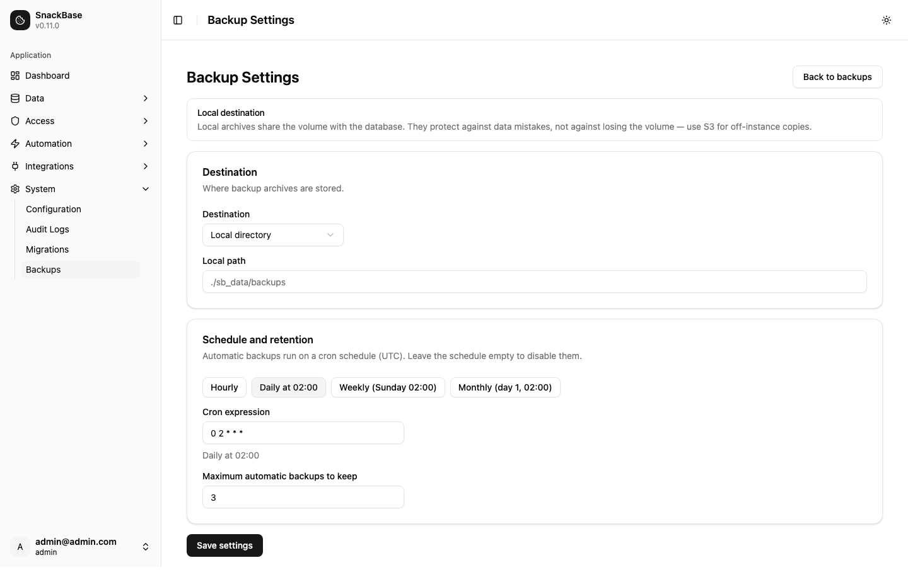
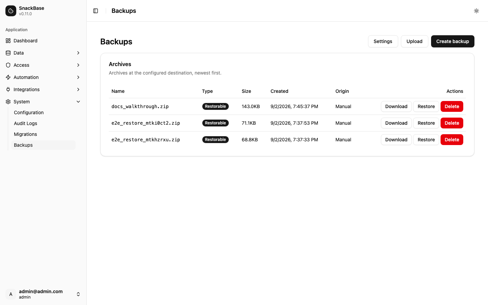
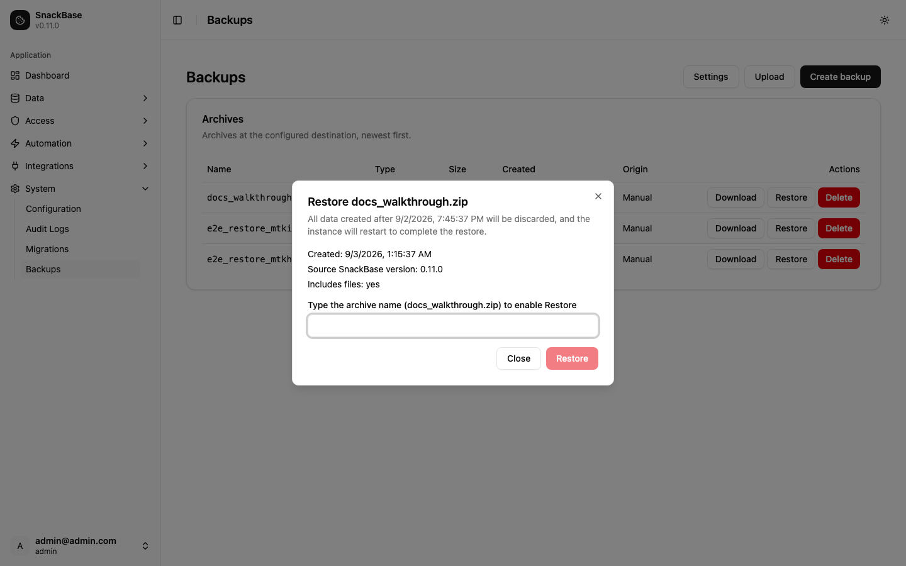

# Backups

SnackBase can back up its database (and locally stored files) into portable zip
archives and restore them. This page is the configuration reference for the
`backup_settings` category. See the operations section for the API and CLI, and
the restore runbook for how restore works.

Backup archives are instance-level. They are distinct from collection export
(F3.14) and records export (F3.15), which operate at collection scope.
Per-account (tenant-scoped) backup is not supported.

## Configuring backups

Backup settings live in the `backup_settings` configuration category (provider
`backup`) and are managed by a superadmin from **System Settings → Backup**, or
through the configuration API. Values changed here take effect without
restarting the instance.

```
POST /api/v1/admin/configuration
{
  "category": "backup_settings",
  "provider_name": "backup",
  "display_name": "Backup Settings",
  "config": { ... }
}
```

### Configuration keys

| Key | Type | Default | Description |
| --- | --- | --- | --- |
| `destination` | string enum | `local` | Where archives are stored: `local` or `s3`. |
| `local_path` | string | `./sb_data/backups` | Directory for archives when `destination` is `local`. Created automatically. |
| `s3_bucket` | string | — | Bucket for archives when `destination` is `s3`. Required for S3. |
| `s3_region` | string | — | AWS region of the bucket. |
| `s3_access_key_id` | string | — | AWS access key ID. Leave empty to use the environment credential chain (for example, an instance role). |
| `s3_secret_access_key` | string (secret) | — | AWS secret access key. Stored encrypted at rest and never returned by the API. |
| `s3_key_prefix` | string | — | Optional key prefix so archives can share a bucket with other content. |
| `s3_endpoint_url` | string | — | Optional custom endpoint for S3-compatible stores (MinIO, R2, LocalStack). |
| `cron` | string (cron) | `""` (empty) | 5-field cron expression for automatic backups, for example `0 2 * * *` (daily at 02:00 UTC). Empty disables scheduled backups. |
| `max_keep` | integer (min 1) | `3` | How many automatic (`@auto_`-prefixed) archives to keep. Older ones are pruned after each scheduled backup. |

Validation on write:

- `cron` must parse as a 5-field cron expression (`minute hour day-of-month
  month day-of-week`, with `*`, steps, ranges, lists, and `MON`-style names).
  An invalid expression is rejected with HTTP 400 and the parser's message.
- `max_keep` below `1` is rejected while a schedule (`cron`) is configured.

### Destinations

- **Local** — archives are written under `local_path`. Local archives share the
  volume with the database: they protect against data mistakes, not against
  losing the volume.
- **S3** — archives are uploaded with boto3's managed transfer API (multipart,
  retry), so archive size is not limited by memory. Any S3-compatible endpoint
  works via `s3_endpoint_url`. Credentials are decrypted from the encrypted
  configuration at use time.

The S3 secret is stored with the same encryption-at-rest path as every other
provider credential. Rotating `SNACKBASE_ENCRYPTION_KEY` invalidates it, along
with all other stored credentials.

## Archives and manifests

Every archive is a zip containing a `manifest.json` at its root. The manifest
records the format version, creation time, SnackBase version, backup type,
database engine, Alembic branch heads captured, whether the local `files/` tree
is included, storage mode, per-table row counts, and — importantly —
fingerprints of the three deployment secrets the archive was taken under
(`SNACKBASE_ENCRYPTION_KEY`, `SNACKBASE_SECRET_KEY`, `SNACKBASE_TOKEN_SECRET`).

A fingerprint is the first 16 hex characters of a domain-separated SHA-256 of
the secret. It is not reversible and is not a verifier for the secret; it only
answers "was this archive taken under the same key?". No secret material is
ever written into the manifest.

Restore checks these fingerprints before touching anything: a mismatched
encryption key is a hard refusal (the archive's stored credentials would be
undecryptable), while signing-key mismatches are warnings an operator can
override knowingly. An archive whose manifest format is newer than the running
SnackBase supports is refused rather than misread.

## Creating and managing backups

### Admin API

All endpoints require superadmin access and live under `/api/v1/backups`.

| Endpoint | Purpose |
| --- | --- |
| `POST /api/v1/backups` | Start creating an archive; returns 202. Body `{"name": "my_backup.zip"}` is optional — without it the archive is named `snackbase_backup_<UTC yyyymmddHHMMSS>.zip`. |
| `GET /api/v1/backups` | List every archive (newest first) with `name`, `size`, `modified`, and `is_automatic`, plus the `active` in-flight operation when one is running. |
| `DELETE /api/v1/backups/{name}` | Delete an archive (204). Returns 404 for an absent name and 409 while it is being written. |
| `GET /api/v1/backups/{name}/download` | Stream the archive as `application/zip` attachment. |
| `POST /api/v1/backups/upload` | Multipart upload of an archive taken elsewhere. The payload must be a readable zip carrying a parsable `manifest.json`. |

Manual archive names must match `^[a-z0-9_-]{1,150}\.zip$`. The `@` character is
reserved: automatic backups are named `@auto_…`, and a manual name can never
collide with the retention prefix. Duplicate names answer 409, as does a create
while another backup or restore is in flight (the response names the running
operation). Uploads are exempt from the user-file `max_file_size` limit —
archives are legitimately large.

Only one backup or restore runs at a time. In-flight state is kept in memory
plus a lock file at the backup directory, never in the database, so no backup
job row can be captured by its own snapshot and restored as a stuck `running`
job.

### CLI

```bash
uv run python -m snackbase backup create [--name TEXT]
uv run python -m snackbase backup list
uv run python -m snackbase backup delete NAME [--yes]
```

The commands talk to the configured destination directly and work without a
running server, so they can be driven by an external cron. `backup delete`
prompts for confirmation unless `--yes` is passed. Every backup event —
`backup.create.started`, `backup.create.completed`, `backup.create.failed`,
`backup.delete` — is appended to the immutable audit log, recording the archive
name, destination type, byte size on completion, and the acting user (`system`
for CLI and scheduled runs).

### Disk space

Creating a backup needs roughly **2× the database size** of free disk space at
the backup location: the `VACUUM INTO` snapshot plus the compressed archive
coexist during the build. The snapshot and its staging archive are deleted on
both success and failure.

### How consistency works

SQLite snapshots use `VACUUM INTO`, which writes a transactionally consistent
copy of the database under a brief lock — a backup taken under heavy write
load captures a coherent state with no partial transactions. The snapshot
passes `PRAGMA integrity_check` and is independent of the live WAL. The
archive layout is:

```
manifest.json        self-describing metadata (see above)
data.db              the VACUUM INTO snapshot
files/<account_id>/… the tree under settings.storage_path (local storage only)
```

When the active file storage provider is S3, the `files/` tree is not archived
(files live in the bucket, not on the volume) and the manifest records
`includes_files: false` and `storage_mode: "s3"`. The backup directory itself
is never included in an archive.

## Restoring a backup

### How restore works

Restore never swaps data in a running process. Instead:

1. You request the restore (API or CLI). SnackBase validates the archive —
   zip layout, `manifest.json`/`data.db` presence, secret fingerprints, engine —
   and, if everything passes, writes a marker file
   (`.restore-pending.json`) **beside the SQLite database file** and answers 202.
2. The instance schedules its own graceful shutdown (SIGTERM after the
   response flushes, exit code 75). The marker is the transaction record.
3. The supervisor restarts the process. At startup — **before the database
   engine is created and before migrations run** — SnackBase finds the marker,
   moves the current database (with its `-wal`/`-shm` siblings), the dynamic
   collection migrations (`sb_data/migrations/`), and the local files tree
   aside under `.restore_old/<timestamp>/`, moves the archive's `data.db`,
   `migrations/`, and `files/` into place, and deletes the marker. Only then
   does the boot continue and migrations run.
4. After migrations, the boot verifies the restored schema against the
   archive's recorded table row counts and promotes the outcome from
   `swapped` to `completed` (or `completed_with_warnings`, listing any
   tables or row counts that drifted).

Because the swap happens before anything opens the database, a restore cannot
corrupt a live instance, and a crash mid-restore is simply retried on the next
boot: if a marker is present alongside `.restore_old/` data carrying an
in-progress sentinel from an interrupted attempt, that data is rolled back
first and the restore retried.

The dynamic migration scripts travel inside the archive because the restored
database's `alembic_version` refers to them. Restoring them with the database
guarantees the post-swap migration run (`upgrade heads`) evaluates the
database against its own history: on a fresh instance it can resolve every
revision, and delete-migrations written after the backup was taken cannot
replay to drop restored tables. Core migrations still come from the binary,
so restoring an older archive into a newer binary still applies new core
migrations normally.

### Requirements

- **Restart policy**: the instance must be restarted after the restore
  request. The container restart policy must be `unless-stopped` or `always`
  (`docker-compose.yml` already sets `unless-stopped`), or a supervisor with
  the equivalent behaviour. Without a restart the marker stays pending and
  the restore begins on the next manual start.
- **Disk space**: extraction needs roughly **2× the archive size** in free
  disk space. A restore aborts with an explicit message when free space is
  insufficient, leaving the instance untouched.

### Compatibility checks

Before anything is written, the archive's manifest is checked against the
running instance:

- *Blocking* (never overridable): mismatched `SNACKBASE_ENCRYPTION_KEY`
  (stored credentials would be undecryptable), a manifest format outside the
  supported range (archives from before format version 2 carry no migration
  history and cannot be restored safely; newer formats need a newer binary),
  an archive taken on a different database engine, or a logical archive
  (PostgreSQL export — see below).
- *Warnings* (overridable with `force: true` / `--force`): mismatched
  `SNACKBASE_SECRET_KEY` or `SNACKBASE_TOKEN_SECRET` — restoring works, but
  existing sessions and API keys are invalidated — and a storage-mode
  mismatch (an archive taken with S3 storage restored onto a local-storage
  instance, or the reverse).

### API

```
POST /api/v1/backups/{name}/restore     {"force": false}
GET  /api/v1/backups/restore-status
```

The restore endpoint returns 202 with the marker contents and schedules the
restart. Rejections return 400 (invalid archive, blocking issues, warnings
without `force`, or non-SQLite instance) or 404 (unknown archive). The
status endpoint reports the last restore's outcome — `archive_name`,
`status` (`swapped`/`completed`/`completed_with_warnings`/`failed`),
`completed_at`, `error` when failed, and `warnings` when verification found
drift — read from `.restore-last.json` in the data directory. `completed`
means migrations ran and the restored schema matched the archive; `swapped`
means the data is in place but the boot has not finished verifying it.

### CLI

```bash
uv run python -m snackbase backup restore NAME [--force] [--yes]
```

The command prints a summary (archive name, creation time, source SnackBase
version, whether files are included, compatibility warnings) and prompts for
confirmation unless `--yes` is passed. It writes the same marker as the API;
the restore itself completes on next start.

### Recovering from a restore

- **Automatic window**: the pre-restore data stays under
  `.restore_old/<timestamp>/` for `SNACKBASE_RESTORE_RETAIN_OLD_DATA_HOURS`
  (default 24) hours, then is removed at the next boot.
- **Manual recovery**: to go back to the pre-restore state, stop the
  instance, copy `data.db` from `.restore_old/<timestamp>/` over the
  database file, restore `migrations/` over `sb_data/migrations/` and
  `files/` over the storage path, delete the marker file if present, and
  start the instance. The `migrations/` directory must be restored together
  with `data.db` — the database's `alembic_version` refers to those scripts.

### PostgreSQL

Restore is SQLite-only. On PostgreSQL the database is a separate system the
application does not own: configure disaster recovery on the database itself
(managed snapshots or operator-run `pg_dump`/`pg_restore`). PostgreSQL
backups produced by SnackBase are *portable logical archives* for inspection
and environment seeding — they are explicitly not restorable in this
release, and the API reports them with `restorable: false`.

## Schedule format and retention semantics

### Cron format

The `cron` key uses the standard 5-field syntax, evaluated in UTC:

```
minute hour day-of-month month day-of-week
```

Each field supports `*` (any), `*/n` (steps), `n-m` (inclusive ranges),
`n,m,k` (lists), and name aliases (`JAN`–`DEC`, `SUN`–`SAT`; 7 means Sunday
in day-of-week). Examples:

| Expression | Meaning |
| --- | --- |
| `* * * * *` | Every minute |
| `*/15 * * * *` | Every 15 minutes |
| `0 * * * *` | Hourly |
| `0 2 * * *` | Daily at 02:00 UTC |
| `0 2 * * SUN` | Weekly, Sunday 02:00 UTC |
| `0 2 1 * *` | Monthly on day 1 at 02:00 UTC |

Changes to the cron expression are picked up within one scheduler tick (60
seconds) with no restart; the next run is always computed forward from now,
so a restart never fires a missed window.

### The `@auto_` prefix and retention

Automatic archives are named `@auto_snackbase_<UTC yyyymmddHHMMSS>.zip`. The
`@` character is reserved: manual and uploaded archive names cannot contain
it (`^[a-z0-9_-]{1,150}\.zip$`), so retention can never catch a manual
archive.

After each successful scheduled backup, the destination is listed under the
`@auto_` prefix and the oldest archives beyond `max_keep` are deleted — the
new archive occupies one of the `max_keep` slots and is never deleted.
Manual and uploaded archives are never touched. Pruning only runs in the
scheduled path, only after the new archive is confirmed written, and a
deletion failure is logged without failing the (already successful) backup.
Every prune is audited as `backup.retention.pruned` naming the deleted
archives.

## PostgreSQL: portable logical archives

`POST /api/v1/backups` routes automatically by engine. On SQLite it produces
a restorable `sqlite_physical` archive; on PostgreSQL it produces a
`logical` archive — one `tables/<name>.jsonl` file per table inside the zip,
exported inside a single `REPEATABLE READ READ ONLY` transaction so the data
is never torn across tables. A SQLite operator can request a logical archive
explicitly with `{"type": "logical"}` (or `backup create --type logical`);
requesting `sqlite_physical` on PostgreSQL is rejected with 400.

Logical archives are **portable artifacts, not recovery artifacts**: they are
for inspection, environment seeding, and migration preparation, and the API
reports every logical archive with `restorable: false`. They cannot be
imported back, and cross-engine migration (SQLite → PostgreSQL) is
deliberately out of scope. PostgreSQL disaster recovery is configured on the
database itself — managed snapshots or an operator-run `pg_dump` — not in
SnackBase.

Ephemeral tables (`token_blacklist`, `refresh_tokens`, `password_resets`,
`email_verifications`) and `alembic_version` are excluded from logical
exports by design; the manifest records the excluded list.

## Walkthrough

Configuring, creating, and restoring a backup from the admin UI.

### 1. Configure the destination and schedule

Open **System → Backups → Settings**. Choose the destination (Local or S3 —
S3 fields appear only for S3), pick a schedule preset or type a cron
expression (a live human-readable description follows the field), and set
how many automatic archives to keep. Local archives warn that they share the
volume with the database.



### 2. Create and inspect archives

**System → Backups** lists every archive, newest first. **Create backup**
accepts an optional name; **Upload** stores an archive taken elsewhere.
Each row shows its type — `Restorable` for physical archives, `Portable`
for logical ones — plus size, creation time, and whether it was created
automatically. Download and Delete act per row; Delete requires
confirmation.



### 3. Restore

**Restore** opens a confirmation dialog that states exactly what happens:
all data created after the archive's timestamp is discarded and the
instance restarts. Compatibility warnings appear with an explicit
"restore anyway" checkbox; blocking issues disable the confirm button
outright. The operator must type the archive name to enable Restore. After
the request, the dialog follows the restart and reports the outcome from
the restore-status endpoint.



A supervised deployment (container restart policy `unless-stopped` or
`always`) brings the instance back automatically; the swap happens before
the database is opened.
